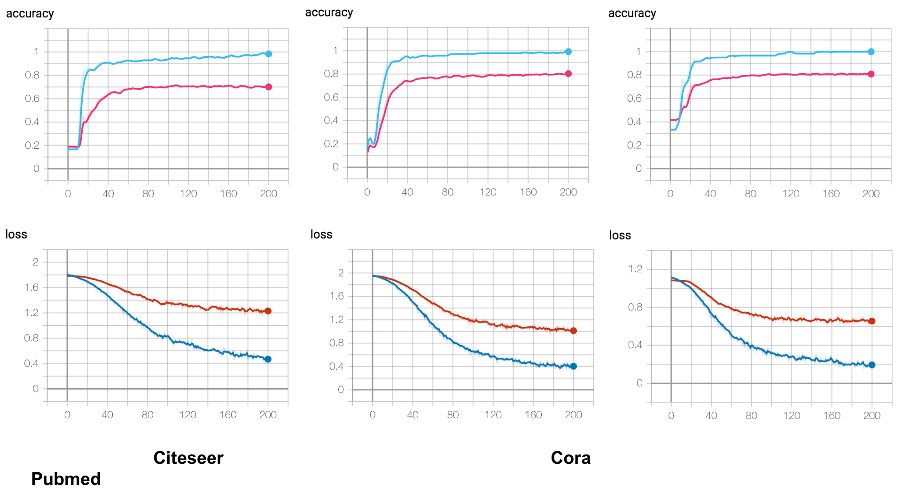
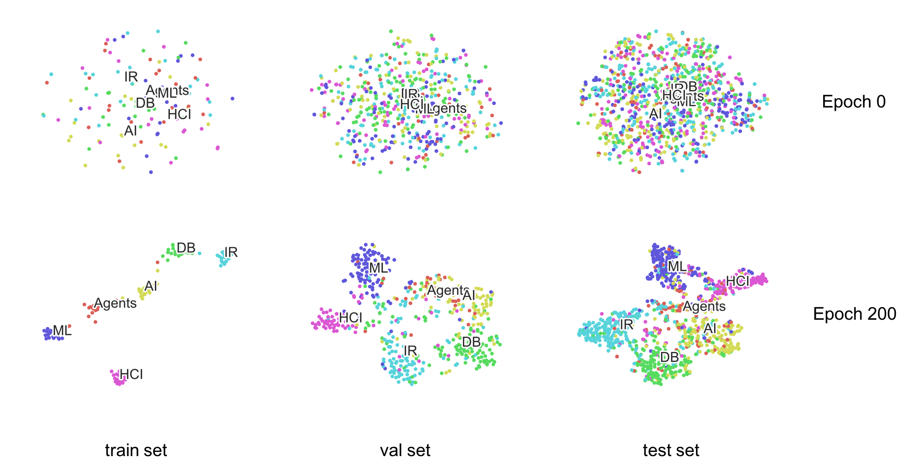
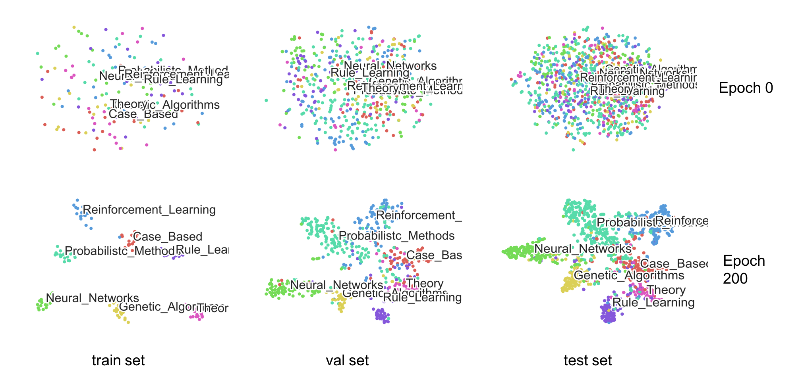
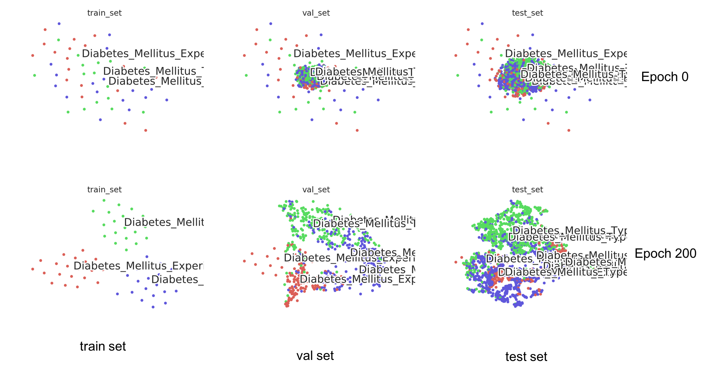

## Introduction
An inofficial PyTorch implementation of [Semi-Supervised Classification with Graph Convolutional Networks](https://arxiv.org/abs/1609.02907).

## Datasets
+ citeseer
+ cora
+ pubmed

| Dataset | Nodes | Edges | Features | Classes | #train | #val | #test |
| :---: | :---:| :---: | :---: | :---:| :---: | :---: | :---: |
| Citeseer | 3,327 | 4,732 | 3,703 | 6 | **120**(20 each class) | **500**(29, 86, 116, 106, 94, 69) | **1000**(77, 182, 181, 231, 169, 160) |
| Cora | 2,708 | 5,429 | 1,433 | 7 | **140**(20 each class) | **500**(61, 36, 78, 158, 81, 57, 29) | **1000**(130, 91, 144, 319, 149, 103, 64) |
| Pubmed | 19,717 | 44,338 | 500 | 3 | **60**(20 each class) | **500**(98, 194, 208) | **1000**(180, 413, 407) |

**Note:** 
+ There are **15 nodes(without features)** in Citeseer dataset.
+ We use dataset splits provided by [https://github.com/tkipf/gcn](https://github.com/tkipf/gcn)
+ More information see [https://linqs.soe.ucsc.edu/data](https://linqs.soe.ucsc.edu/data)


## GCN
W_2])

A is the adjacency matrix(adding **self-loops**), D is the degree matrix, X is the features, W is the parameters.
## Train
```
# usage: python train.py --dataset DATASET
python train.py --dataset citeseer

or

python train.py --dataset cora

or 

python train.py --dataset pubmed
```

## Evaluate
```
# usage: python evaluate.py --dataset DATASET --checkpoint CHECKPOINT
python evaluate.py --dataset citeseer --checkpoint checkpoints/citeseer/gcn_200.pth
```

## Experiment results
+ Accuracy 
    
    |          | Citeseer(%) | Cora(%) | Pubmed(%) |
    | :------: | :------: | :------: | :------: |
    | **this repo**|     70.8    |  82.5   |  79.2     |
    |  paper   |     70.3    |  81.5   |  79.0     |


+ Accuracy and Loss curve(see experiments/results.png)

    
    
    + citeseer
        
        ```
        tensorboard --logdir=experiments/citeseer
        ```
        
    + cora
    
        ```
        tensorboard --logdir=experiments/cora
        ```
    + pubmed
        ```
        tensorboard --logdir=experiments/pubmed
        ```

+ T-SNE Visualization

    + citeseer(see experiments/citeseer_vis.png)
    
        
        
        ```
        python visualize.py --dataset citeseer --checkpoint checkpoints/citeseer/gcn_200.pth
        ```
    
    + cora(see experiments/cora_vis.png)
        
        
        
        ```
        python visualize.py --dataset cora --checkpoint checkpoints/cora/gcn_200.pth
        ```
        
    + pubmed(see experiments/pubmed_vis.png)
    
        
        
        ```
        python visualize.py --dataset pubmed --checkpoint checkpoints/pubmed/gcn_200.pth
        ```
        
        
+ Dropout and Regularization (**results of citeseer for training 200 epoches**)

    | weight_decay | dropout | train ac(%) | val ac(%) | test ac(%) |
    | :---: | :---: | :---: | :---: | :---:|
    | 5e-3  | 0.7 | 90.8 | 68.4 | 70.1 |
    | 5e-3  | 0.5 | 91.7 | 70.4 | 71.5 |
    | 5e-3  | 0.2 | 93.3 | 71.0 | **71.8** |
    | 5e-3  | 0.0 | 94.2 | 68.8 | 69.6 |
    | 5e-4  | 0.7 | 97.5 | 70.0 | 70.8 |
    | **5e-4** | **0.5** | 98.3 | 70.2 | 70.8 |
    | 5e-4  | 0.2 | 98.3 | 70.8 | 70.7 |
    | 5e-4  | 0.0 | 98.3 | 71.0 | 71.7 |
    | 5e-5  | 0.7 |100.0 | 67.8 | 68.3 |
    | 5e-5  | 0.5 |100.0 | 70.6 | 69.1 |
    | 5e-5  | 0.2 |100.0 | 68.2 | 69.5 |
    | 5e-5  | 0.0 |100.0 | 67.4 | 68.0 |
    | 0.0   | 0.7 |100.0 | 68.0 | 68.0 |
    | 0.0   | 0.5 |100.0 | 68.0 | 67.6 |
    | 0.0   | 0.2 |100.0 | 63.8 | 59.7 |
    | 0.0   | 0.0 |100.0 | 64.8 | 63.6 |
    
    **Note:** Bold parameters represents the parameters in the paper.

+ All GCNLayers with regularization (**results of citeseer for training 200 epoches**)

    |   | gcn1 | gcn2  | accuracy(%) |
    | :---: | :---: | :---: | :---: | 
    | experiment| reg  | reg   | 71.9 |
    | **paper** | reg  | no-reg | 70.8 |

+ Nums of train samples (**results of citeseer for training 200 epoches**)

    | # train samples  | accuracy(%) |
    | :---: | :---: | 
    | 120 | 70.8 | 
    | 240 | 70.6 | 
    | 360 | 71.5 |
    